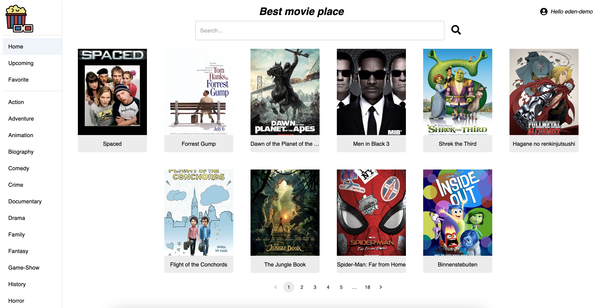

# Eden's movies app

This project was made by me to showcase some of my capabilities in fullstack-development.
The website is written in react with typescript. It's hosted on [AWS amlify](https://aws.amazon.com/pm/amplify/), with a backend on [AWS Lambda](https://aws.amazon.com/pm/lambda/), and an [RDS](https://aws.amazon.com/pm/rds/) mysql DB.
The backend code can be found on my github [here](https://github.com/edenRorman/eden-movies-aws-lambda).

You can visit the website on the address: [https://main.d2oyia48f1kuq2.amplifyapp.com/home](https://main.d2oyia48f1kuq2.amplifyapp.com/home)

## Project strcture

This project was bootstrapped with [Create React App](https://github.com/facebook/create-react-app).

This project uses [react-router](https://reactrouter.com/en/main) to handle multiple pages.

The website has a simple sign-in functionality in order to save your favorite movies :)

## Running locally

In order to run it locally you can use `npm start`. This will compile the code, and setup a local server on `http://localhost:3000/`.

## Deploment

This repo is connected to AWS Amplify, so on each push to the `main` branch, a new version is automatically deployed to our public url at [https://main.d2oyia48f1kuq2.amplifyapp.com/home](https://main.d2oyia48f1kuq2.amplifyapp.com/home)
